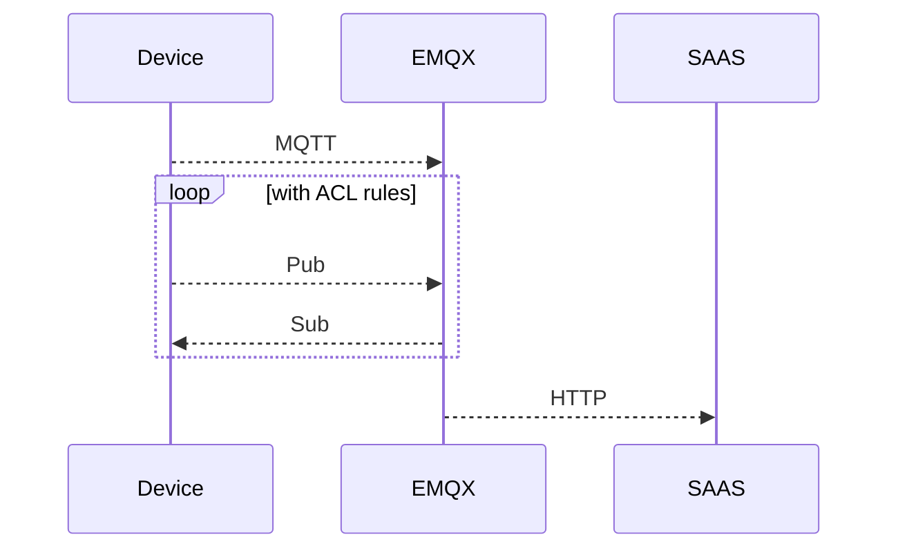

# 1. 问题背景

AWS IoT 的 MQTT 协议有一些限制:

- 用户名密码认证需要做自定义认证
- 自定义认证也需要 TLS 的 ALPN 设置
- Topic 不能使用$开头
- 默认的 IoT 证书有效期五年(但支持自签证书)

同时, 市场上的一些 IoT 设备大多都是通过用户名密码方式认证客户端的而不是证书认证, 所以如果要使用 AWS IoT 就有很多不便, 所以最好是有一种更通用和开放性的 MQTT Broker, 最好也有一定的扩展性, 比如可以和现有其他厂商或者服务集成.

# 2. [EMQX](https://www.emqx.com/zh)介绍

## 2.1 [EMQ 公司调研](https://www.emqx.com/zh)

- [公司介绍](https://www.emqx.com/zh/about)

  EMQ（杭州映云科技有限公司）是一家开源物联网数据基础设施软件供应商，交付全球领先的开源云原生 MQTT 消息服务器和流处理数据库，为企业云边端的海量物联网数据提供高可靠、高性能的实时连接、移动、处理与集成，助力构建「面向未来」的物联网平台与应用。

  EMQ 公司成立于 2017 年，总部位于杭州，海外研发中心设在斯德哥尔摩，分支机构与团队遍布全球 4 个国家 10 余个城市。旗舰产品 EMQX 拥有来自 50 多个国家的 20,000 多家企业用户，连接全球超过 1 亿台物联网设备，服务企业数字化、实时化、智能化转型。

- 投资机构

  

- 奖项与荣誉

  

- 总部及分支结构

  

- 工商信息

  

查看所有企业信息: https://qiye.qizhidao.com/company/75e02febd25c643637ba86056b50ba30.html

- 注册资本: 5100 万
- 2024 年中标五家: [山东大学](https://qiye.qizhidao.com/company/0da3be852c8d9f6da10172a08138611f.html)/[北大荒信息有限公司](https://qiye.qizhidao.com/company/b1ca71b47d1f89892a79823488c2d5f7.html)/[中国电建集团江西省电力建设有限公司](https://qiye.qizhidao.com/company/667c5f5dfe2b013bf35c04fbb9deac04.html)/[中国电建集团江西省电力建设有限公司](https://qiye.qizhidao.com/company/667c5f5dfe2b013bf35c04fbb9deac04.html)/[电福富信息科技有限公司](https://qiye.qizhidao.com/company/8139123c71bc8a33b7afa2b93b1b428c.html)

## 2.2 计费对比

### 2.2.1 [EMQ 产品计费](https://docs.emqx.com/zh/cloud/latest/price/pricing.html)

以下是 Serverless 计费规则:

| **计费项** | **免费额度**          | **计费**             |
| :--------- | :-------------------- | :------------------- |
| 连接费     | 每月 1 百万连接分钟   | ¥8.00/百万连接分钟   |
| 流量费     | 每月 1GB              | ¥1.50/GB             |
| 规则动作   | 每月 1 百万规则动作数 | ¥1.80/百万规则动作数 |

### 2.2.2 [AWS IoT 计费](https://www.amazonaws.cn/iot-core/pricing/)

以中国(宁夏)区域为参考如下:

| 连接定价（每百万分钟连接）                            |                  |
| :---------------------------------------------------- | ---------------- |
|                                                       | **定价（宁夏）** |
| 百万分钟连接                                          | ¥0.72            |
| 信息定价（每百万条信息）                              |                  |
| **每月的信息量**                                      | **定价（宁夏）** |
| 不到 10 亿条消息                                      | ¥8.97            |
| 后续 40 亿条消息 (>1B)                                | ¥7.17            |
| 超过 50 亿条消息 (>5B)                                | ¥6.28            |
| **规则引擎定价（每百万次触发规则/每百万次执行操作）** |                  |
|                                                       | **定价（宁夏）** |
| 百万次规则触发                                        | ¥1.35            |
| 百万次执行操作                                        | ¥1.35            |
| **事物影子和事务注册定价（每百万次操作）**            |                  |
|                                                       | **定价（宁夏）** |
| 百万次操作                                            | ¥11.21           |

## 2.3 专业性

EMQX 是[mqtt.org](https://mqtt.org/software/)推荐云 Broker 产品.

# 3. EMQX 使用和实践

## 3.1 访问控制

### 3.2.1 [客户端认证](https://docs.emqx.com/zh/cloud/latest/deployments/auth_overview.html)

可以创建用户名密码, 建议不同的项目或者不同的客户创建不一样的凭据.

### 3.2.2 [客户端授权](https://docs.emqx.com/zh/cloud/latest/deployments/authz_overview.html)

强烈建议[开启授权白名单模式](https://docs.emqx.com/zh/cloud/latest/deployments/default_authz.html#%E5%BC%80%E5%90%AF%E6%8E%88%E6%9D%83%E7%99%BD%E5%90%8D%E5%8D%95%E6%A8%A1%E5%BC%8F): 点击部署左侧菜单中的**访问控制**-> **客户端授权**，在**全部用户**标签下添加一条授权信息，**主题**中输入 `#`，**主题动作**选择`发布 & 订阅`，**权限**选择`不允许`，点击**确认**开启白名单模式。

## 3.2 EMQX 连接器--HTTP Server

该连接器可以[将 MQTT 数据发送到 HTTP 服务](https://docs.emqx.com/zh/cloud/latest/data_integration/http_server.html), 架构上看 EMQX 是一层代理将 MQTT 转 HTTP, 业务上只需要实现一个接口可以处理 HTTP 请求即可.

自定义一个 HTTP 服务, 这个服务可以使用现有 API, 安全考虑可以在 HTTP 服务请求头中增加 JWT, 然后在现有 API 测进行验证, 然后配置规则, 将 EMQX 收到的消息使用 HTTP 服务发送到现有 API 服务, 进而打通数据交互.

### 3.2.1 [添加 HTTP 服务](https://docs.emqx.com/zh/cloud/latest/data_integration/http_server.html#%E5%88%9B%E5%BB%BA-http-server-%E8%BF%9E%E6%8E%A5%E5%99%A8)


### 3.2.2 [创建转发规则](https://docs.emqx.com/zh/cloud/latest/data_integration/http_server.html#%E5%88%9B%E5%BB%BA%E8%A7%84%E5%88%99)


建议调整 SQL 如下以支持任何 Topic 的筛选:

```sql
SELECT
  *
FROM
  "#"
```

SQL 语法[参考地址](https://docs.emqx.com/zh/emqx/latest/data-integration/rule-sql-syntax.html)

### 3.2.3 [创建动作](https://docs.emqx.com/zh/cloud/latest/data_integration/http_server.html#%E5%88%9B%E5%BB%BA%E8%A7%84%E5%88%99)


```json
{"payload": ${payload}, "clientid": "${clientid}", "topic": "${topic}", "username": "${username}", "timestamp": ${timestamp}}
```

### 3.2.4 HTTP 服务实现

使用 nest.js+typescript 实现核心的逻辑如下:

```typescript
import {
  Body,
  Controller,
  Get,
  Param,
  Post,
  Query,
  Res,
  Response,
  Headers,
} from "@nestjs/common";
import { AppService } from "./app.service";

@Controller()
export class AppController {
  constructor(private readonly appService: AppService) {}

  @Post("mqttReceive")
  async mqttReceive(@Body() body, @Headers("Authorization") token) {
    const data = Buffer.from(body).toString();
    const receiveData = { data, token };
    const secret = Buffer.from("jimmys-emqx-research-http-server");
    const jwtResult = await jose.jwtVerify(token, secret);
    console.log({ jwtResult, receiveData });
    const parsedData = JSON.parse(data) as {
      payload: any;
      clientid: string;
      topic: string;
      username: string;
      timestamp: number;
    };
    console.log("parsedData:", data);
    return parsedData;
  }
}
```

> [!note]
>
> 使用 secret 生成的 token 被配置到了 EMQX, 这里读取后验证, 需要注意要使用同一个 secret.

# 4. 总结

EMQX 是兼容行很好的 Broker, 如果是小型项目其 Severless 版本的免费额度就够支持项目运行了, 另外其功能丰富, 最基础的 HTTP Server 连接器可以将 MQTT 消息转为 HTTP, 方便和现有服务(SAAS)集成; 另外其客户端授权/认证管理规则也很简单且支持批量导入. 从设备数据上行角度看架构如下:



对于 AWS IoT, EMQX 降低了设备接入难度, 限制条件也少了很多, 但是需要注意的是: Serverless 版本因为安全行问题不支持 MQTT, 解决方案是在 IoT 设备导入 CA 证书走 MQTTS 协议, 即便如此这比 AWS IoT 的限制也少多了. 如果希望更简单, 那么可以考虑部署专有版本, 其支持 MQTT, 这样一般的设备不用做什么开发, 只需要配置 Broker/用户名/密码/Topic 即可使用了, 例如 Acrel ADW300-4G 的电表.
