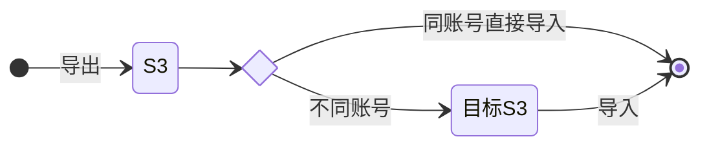

# 1. 技术背景

在多环境开发时数据同步是常见的问题, 数据量小的时候可以通过写脚本来同步, 但是数量很大时脚本就不是很好的选择, 主要是脚本运行时间将会很长, 并且为了让脚本运行正常, 还需要找个稳定的环境, 不断网不休眠持续的跑脚本, 所以脚本有脚本优势但对于需要高效同步的场景却是不合适. 如果数据量很大那么怎么同步呢? 本文介绍通过 DynamoDB 的导出导入方式实现数据的同步.

导出导入方案基于: DynamoDB Table 支持将数据导出 S3, 又支持从 S3 导入数据的特性. 经过实际的测试和验证, 实现同步的步骤如下:



如果想知道该方案是否适合, 请查看[总结](#summary).

# 2. DynamoDB 数据导出和导入

假设有两个环境: sandbox 和 dev, 首先在 sandbox 针对一个大表做导出, 然后将导出文件同步到 dev, 最后在 dev 中做导入.

## 2.1 导出

在 DynamoDB 的控制台中点击左侧菜单`导出到S3`, 选择原表, 填写导出的 s3 位置, 然后进行导出操作:


> [!note]
>
> - 注意导出的文件格式, 导入的时候格式要一致
> - 注意加密密钥类型, 建议选择默认的 Amazon S3 密码(SSE-S3), 这样导出的文件被同步到其他账号下时只要有 S3 的权限就可以解密文件而不需要和导出时相同的密码

## 2.2 同步数据文件

理论上只需要同步导出的`data`目录下的数据文件即可, 这里为了演示同步了所有导出的文件到目标 s3, 使用的同步工具是[mc](https://min.io/docs/minio/linux/reference/minio-mc.html), 具体命令如下:

```bash
mc cp -r sandbox/nnsay-cn/dynamodb/ dev/nnsay-cn-dev/dynamodb/
```

## 2.3 导入

切换登录到 dev 的 DynamoDB 控制台, 在左侧菜单选择`从 S3 导入`, 按照引导完成配置即可, 最后的配置结果如下:


> [!note]
>
> - 注意之前导出的数据是 gz 压缩格式, 所以压缩格式需要选择: GZIP
> - 目标表必须是一个新表, 现有的表不行, 在点击导入后会报错
> - 需要手动指定哈希键和排序键
> - 导出结果中没有全局二级索引, 所以如果需要在第二个步骤中需要手动添加配置

## 2.4 验证

从 dev 的 import-test 表中检查数据:

```bash
aws dynamodb scan --table-name import-test --select "COUNT"

{
    "Count": 1000,
    "ScannedCount": 1000,
    "ConsumedCapacity": null
}
```

sandbox 中原表的假数据就是 1000, 所以上面的命令返回数据是 1000 则说明导出成功.

# 3. 总结

<a name="summary"></a>
虽然基于导出导入可以实现大表的同步, 但是这种方案也不是十分完美, 以下事项需要注意:

- 实时数据无法顾及, 导出导入方案对于热数据肯定是无能为力, 如果有热数据场景需要配合脚本或者其他方案共同施行
- 现有目标表无法导入, 导入要去创建一个新表, 对于已经有的表则无法导入, 这点和备份恢复的行为一样, 都是需要创建新表
