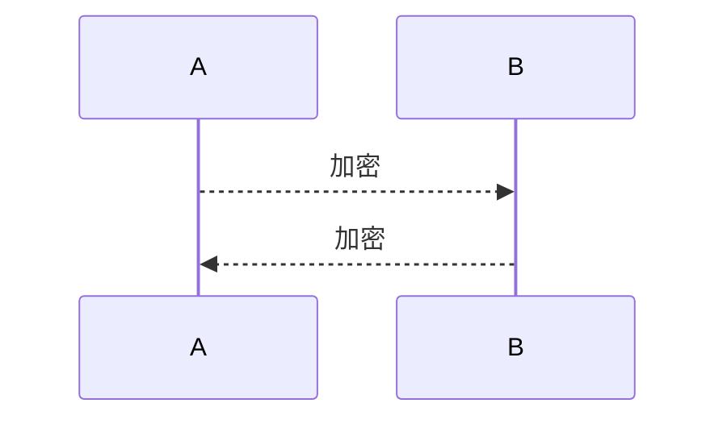
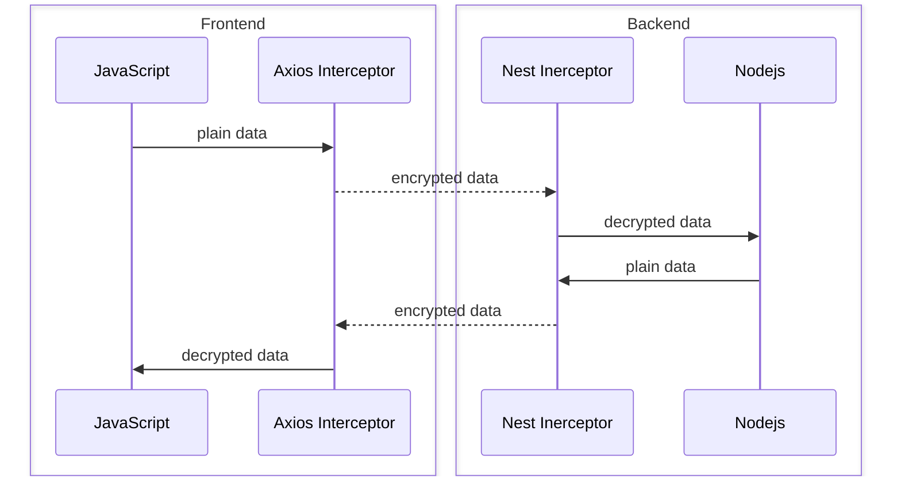

# 1. 背景介绍

前后端分离后, 前端负责 UI/UX, 而数据的计算/存储都在后端, 前端通过 Ajax 请求后端 API 进行业务逻辑的实现, 在此过程中 Ajax 的中的数据会被查看和分享, 导致敏感信息的泄露;

除此之外网站可能会提供下载功能, 下载的文件中也可能包含敏感信息, 这些信息有系统的也有业务的, 文件被分享后那么系统的敏感信息也会被泄露;

最后因为前端是可交互的, 用户也可以通过最简单的复制等方式获取数据, 这也会导致敏感数据被泄露;

本文主要调研前端如何通过"加密"手段防止客户端信息泄露,或者说通过加密的手段让信息分享变得困难.

# 2. 技术分析

信息加密是个老生常谈的话题, 经典的实现方式如下:



- A 加密信息请求 B
- B 解密后处理, 并将返回信息加密传给 A
- A 解密使用

上图是经典端到端加密的设计, 这不是本文的要讨论的. HTTPS 保证传输的安全, 但是防止不了客户端浏览数据的安全性, 客户可以从以下几个途径获取数据:

- 客户通过浏览器开发者工具获取 Ajax 数据
- 客户通过网站提供的下载功能获取数据
- 客户通过爬取/复制页面信息获取数据

## 2.1 Ajax 加密可行性分析

实际上，要完全阻止浏览器查看 AJAX 请求是不太可能的，因为浏览器是用户端的工具，用户在浏览器中执行的一切操作都是可以被观察到的。即使你采取了一些措施来增加请求的安全性，仍然无法阻止技术高手或攻击者使用各种方法来查看网络请求。但是可以增加浏览信息的难度, 比如服务器端返回加密的返回值, 设计如下:



## 2.2 文件机密可行性

文件加密可以通过文件内容的加密实现, 文件内容加密后即使文件被分享, 其内容也是受保护的. 具体实现如下:

- 保存文件

  ```mermaid
  flowchart LR
  p([plain data]) --> e([encrypt])
  e --> f([file])
  ```

- 读取文件

  ```mermaid
  flowchart LR
  f([file]) --> d([decrypt])
  d --> p([plain data])
  ```

## 2.3 浏览器行为控制可行性

### 2.3.1 [禁止网页复制](https://juejin.cn/post/6970693668411801614)

- 通过 JavaScript 实现

  ```js
  // 禁止右键菜单
  document.oncontextmenu = function () {
    return false;
  };
  // 禁止文字选择
  document.onselectstart = function () {
    return false;
  };
  // 禁止复制
  document.oncopy = function () {
    return false;
  };
  // 禁止剪切
  document.oncut = function () {
    return false;
  };
  ```

  恢复:

  ```js
  document.body.oncopy = null;
  document.body.oncut = null;
  document.body.onselectstart = null;
  document.body.oncontextmenu = null;
  ```

- 通过 HTML 实现

  ```html
  <body
    oncopy="return false"
    oncut="return false;"
    onselectstart="return false"
    oncontextmenu="return false"
  >
    <!--……-->
  </body>
  ```

- 通过 CSS 实现

  ```css
  body {
    -moz-user-select: none; /* Firefox私有属性 */
    -webkit-user-select: none; /* WebKit内核私有属性 */
    -ms-user-select: none; /* IE私有属性(IE10及以后) */
    -khtml-user-select: none; /* KHTML内核私有属性 */
    -o-user-select: none; /* Opera私有属性 */
    user-select: none; /* CSS3属性 */
  }
  ```

  恢复:

  ```js
  document.body.style.webkitUserSelect = "auto"; // Firefox
  document.body.style.userSelect = "auto"; // Chrome
  //......
  ```

### 2.3.2 禁止爬虫(copyright @ChatGPT)

禁止网站被爬虫爬取是一种常见的做法，通常是为了保护网站内容、减少不必要的流量或者防止竞争对手获取敏感信息。以下是一些常见的方法来禁止网站被爬虫爬取：

1. **robots.txt 文件：** 这是一个位于网站根目录下的文本文件，用于告诉搜索引擎和爬虫哪些页面可以访问，哪些不可以。你可以在 robots.txt 文件中使用 User-agent 和 Disallow 指令来限制爬虫的访问。但需要注意的是，这只是一个建议，不是所有爬虫都会遵守这些规则。

   例如，要禁止所有爬虫访问你的整个网站，可以在 robots.txt 中添加以下内容：

   ```
   copy codeUser-agent: *
   Disallow: /
   ```

2. **User-Agent 检测：** 通过检查访问者的 User-Agent 字段来识别爬虫并阻止它们的访问。但这种方法不够安全，因为爬虫可以伪装成普通浏览器的 User-Agent。

3. **IP 封锁：** 监视访问你网站的 IP 地址，并将恶意爬虫的 IP 地址列入黑名单，以阻止它们的访问。但这需要不断更新黑名单，因为爬虫可以更改 IP 地址。

4. **验证码和人机验证：** 在网站的关键页面或频繁访问的页面上添加验证码或人机验证，要求访问者证明他们是真实的用户而不是爬虫。

5. **动态加载和 JavaScript 渲染：** 使用 JavaScript 来加载页面内容，而不是在 HTML 中直接提供数据。这可以防止简单的爬虫程序从 HTML 源代码中提取信息。

6. **频率限制：** 限制来自同一 IP 地址的请求频率，以防止过于频繁的请求。这可以减轻对服务器的负载，并阻止爬虫从网站上快速抓取大量数据。

7. **登录和会员制：** 要求访问者登录或成为会员才能访问特定内容，这可以有效限制非授权用户的访问。

请注意，没有绝对安全的方法可以完全阻止爬虫，因为有些爬虫可能会采取各种技巧来规避这些限制。因此，通常建议采用多层次的安全措施来减少被爬虫访问的可能性。如果你认为某个爬虫侵犯了你的网站权益，你还可以考虑采取法律行动来保护自己的权益。

## 2.4 总结

- 使用加密/解密算法增加信息获取难度, 保护敏感信息, 该方法支持 Ajax 和文件场景
- 浏览器行为控制作为辅助方法, 防止人肉爬数据

# 3. 技术实现

## 3.1 加密技术选型

因为要同时支持前后端, 后端是 nodejs 的话可以选择一种支持浏览器和 nodejs 的通用包, 比如: [cryptojs](https://cryptojs.gitbook.io/docs/); 或者选择一种前后端都可以实现加密算法, 即使语言不同, 因为实现了相同的加密算法, 也是可以做到前端加密后端解密和后端加密前端解密的, 这种技术比如: [webcrypto](https://developer.mozilla.org/en-US/docs/Web/API/Web_Crypto_API).

加密技术分为对称加密和非对称加密, 一般非对称加密效率高, 不管对称加密还是分对称加密因为解决不了密钥同步不被开发者看到, 所以不管选择哪种都不是绝对的安全(文本不关注端到端加密仅关注增加信息获取难度), 基于此选择效率高的对称加密技术.

`cryptojs` vs `web crypto`具体选择哪种? 本文取决性能测试结果:

- cryptojs

  - nodejs

  ```
  10M 加密耗时: 0.78秒		10M 解密耗时: 0.557秒
  20M 加密耗时: 1.823秒	20M 解密耗时: 1.19秒
  30M 加密耗时: 2.271秒	30M 解密耗时: 1.813秒
  40M 加密耗时: 3.874秒	40M 解密耗时: 2.686秒
  50M 加密耗时: 3.821秒	50M 解密耗时: 3.284秒
  ```

  - 浏览器

  ```
  10M 加密耗时: 5.558秒		10M 解密耗时: 5.444秒
  20M 加密耗时: 11.15秒		20M 解密耗时: 10.926秒
  30M 加密耗时: 16.743秒		30M 解密耗时: 16.431秒
  40M 加密耗时: 22.982秒		40M 解密耗时: 22.343秒
  50M 加密耗时: 28.25秒		50M 解密耗时: 27.871秒
  ```

- web crypto

  - nodejs

  ```
  10M 加密耗时: 0.038秒	10M 解密耗时: 0.027秒
  20M 加密耗时: 0.078秒	20M 解密耗时: 0.058秒
  30M 加密耗时: 0.118秒	30M 解密耗时: 0.091秒
  40M 加密耗时: 0.157秒	40M 解密耗时: 0.119秒
  50M 加密耗时: 0.193秒	50M 解密耗时: 0.166秒
  ```

  - 浏览器

  ```
  10M 加密耗时: 0.823秒	10M 解密耗时: 0.293秒
  20M 加密耗时: 1.468秒	20M 解密耗时: 0.582秒
  30M 加密耗时: 2.145秒  30M 解密耗时: 0.876秒
  40M 加密耗时: 3.152秒  40M 解密耗时: 1.176秒
  50M 加密耗时: 3.937秒	50M 解密耗时: 1.461秒
  ```

根据测试结果, 选择`web crypto`作为前后对称加密算法实现技术

## 3.2 加密解密

根据 3.1 的选型分析, 本小节主要实现 web crypto 的对称加密技术中 AES-CBC 的实现

### 3.2.1 前端加 AES 包

```typescript
export class AES {
  /**
   * AES 密钥 Uint8Array
   */
  private keyArray: Uint8Array;

  /**
   * AES 密钥 CryptoKey
   */
  private key?: CryptoKey;

  /**
   * AES 算法名称
   */
  static ALGORITHM_NAME = "AES-CBC";

  /**
   * AES 算法字节长度
   */
  static ALGORITHM_LENGTH = 256;

  /**
   * AES 算法随机密钥字节长度
   */
  static ALGORITHM_IV_LENGTH = 128;

  /**
   * 构造函数
   * @param key AES密钥
   */
  constructor(key?: string) {
    key = key || "anonymous";
    this.keyArray = this.genKeyArray(key, AES.ALGORITHM_LENGTH);
  }

  /**
   * 生成 CryptoKey Uint8Array
   * @param str key字符串
   * @param bits 长度
   * @returns CryptoKey Uint8Array
   */
  private genKeyArray(str: string, bits: number) {
    const bytes = Math.ceil(bits / 8);
    const buf = new ArrayBuffer(bytes);
    const bufView = new Uint8Array(buf);
    for (let i = 0, strLen = str.length; i < strLen; i++) {
      bufView[i] = str.charCodeAt(i);
    }
    return bufView;
  }

  /**
   * ArrayBuffer 转化为 Base64 字符串
   * @param buffer ArrayBuffer
   * @returns Base64 字符串
   */
  private arrayBufferToBase64(buffer: ArrayBuffer) {
    let binary = "";
    const bytes = new Uint8Array(buffer);
    const len = bytes.byteLength;
    for (let i = 0; i < len; i++) {
      binary += String.fromCharCode(bytes[i]);
    }
    return window.btoa(binary);
  }

  /**
   * Base64 字符串转化为 ArrayBuffer
   * @param base64 Base64 字符串
   * @returns ArrayBuffer
   */
  private base64ToArrayBuffer(base64: string) {
    const binary_string = window.atob(base64);
    const len = binary_string.length;
    const bytes = new Uint8Array(len);
    for (let i = 0; i < len; i++) {
      bytes[i] = binary_string.charCodeAt(i);
    }
    return bytes.buffer;
  }

  /**
   * 导入 CryptoKey
   */
  private async importKey() {
    if (!this.key) {
      this.key = await window.crypto.subtle.importKey(
        "raw",
        this.keyArray,
        {
          name: AES.ALGORITHM_NAME,
          length: AES.ALGORITHM_LENGTH,
        },
        false,
        ["encrypt", "decrypt"]
      );
    }
    return this.key;
  }

  /**
   * 加密
   * @param plaintext 需要加密的字符串
   * @returns 加密后的 base64 字符串
   */
  async encrypt(plaintext: string) {
    const key = await this.importKey();

    const iv = window.crypto.getRandomValues(
      new Uint8Array(AES.ALGORITHM_IV_LENGTH / 8)
    );
    const encrypted = await window.crypto.subtle.encrypt(
      {
        name: AES.ALGORITHM_NAME,
        iv,
      },
      key,
      new TextEncoder().encode(plaintext)
    );

    const encryptedUnit8Array = new Uint8Array(encrypted);
    const ivEncrypted = new Uint8Array(iv.length + encryptedUnit8Array.length);
    ivEncrypted.set(iv);
    ivEncrypted.set(encryptedUnit8Array, iv.length);
    return this.arrayBufferToBase64(ivEncrypted);
  }

  /**
   * 解密
   * @param base64Str 加密后的 base64 字符串
   * @returns 解密后字符串
   */
  async decrypt(base64Str: string) {
    const key = await this.importKey();

    const base64Uint8Array = new Uint8Array(
      this.base64ToArrayBuffer(base64Str)
    );
    const iv = base64Uint8Array.subarray(0, AES.ALGORITHM_IV_LENGTH / 8);
    const data = base64Uint8Array.subarray(AES.ALGORITHM_IV_LENGTH / 8);
    const decrypted = await window.crypto.subtle.decrypt(
      {
        name: AES.ALGORITHM_NAME,
        iv,
      },
      key,
      data
    );
    return new TextDecoder().decode(decrypted);
  }

  /**
   * 解构对象
   * @param plaintext 解密后的字符串
   * @returns 指定T类型的对象
   */
  parse<T>(plaintext: string): T {
    const jsonRegExp = new RegExp("^[\\{\\[].*[\\}\\]]$");
    if (jsonRegExp.test(plaintext)) {
      return JSON.parse(plaintext) as T;
    }
    return plaintext as T;
  }
}
```

‼️ 注意: 这里为了 AES 包对外使用简单, AES 算法`iv`是加在了加密数据中, 解密时可以从加密数据中截取`iv`, 当然为了更简单还可以 hardcode

### 3.2.2 前端 Axios 拦截器

```typescript
import { AES } from '前端AES包'
import axios from 'axios'

const aes = new AES(你的AES密钥)
const demoApi = axios.create({
    baseURL: 'https://api-dev.xxx.cn/demo',
    headers: {
      Authorization:
        'Bearer X,
    },
  })
demoApi.interceptors.response.use(async res => {
  const data = res.data
  if (typeof data === 'string' && data.indexOf('{') === -1 && data.indexOf('[') === -1) {
    console.log('Original Data: ', data)
    res.data = aes.parse(await aes.decrypt(data))
  }
  // TIP: 细粒度的控制
  // const path = res.request.path
  // const method = res.request.method
  // if (method === 'GET' && path === '') {
  //   // TODO: 自定义逻辑
  //   return res
  // }
  return res
})
```

### 3.2.3 后端 AES 包

```typescript
import { webcrypto } from "crypto";

export class AES {
  /**
   * AES 密钥 Uint8Array
   */
  private keyArray: Uint8Array;

  /**
   * AES 密钥 CryptoKey
   */
  private key: webcrypto.CryptoKey;

  /**
   * AES 随机密钥
   */
  private iv: Uint8Array;

  /**
   * AES 算法名称
   */
  static ALGORITHM_NAME = "AES-CBC";

  /**
   * AES 算法字节长度
   */
  static ALGORITHM_LENGTH = 256;

  /**
   * AES 算法随机密钥字节长度
   */
  static ALGORITHM_IV_LENGTH = 128;
  /**
   * AES 算法
   */
  static DEFAULT_AES_KEY = "anonymous";
  /**
   * 构造函数
   * @param key AES密钥
   */
  constructor(key: string) {
    this.keyArray = this.genKeyArray(key, AES.ALGORITHM_LENGTH);
    this.iv = webcrypto.getRandomValues(
      new Uint8Array(AES.ALGORITHM_IV_LENGTH / 8)
    );
  }

  /**
   * 生成 CryptoKey Uint8Array
   * @param str key字符串
   * @param bits 长度
   * @returns CryptoKey Uint8Array
   */
  private genKeyArray(str: string, bits: number) {
    const bytes = Math.ceil(bits / 8);
    const buf = new ArrayBuffer(bytes);
    const bufView = new Uint8Array(buf);
    for (let i = 0, strLen = str.length; i < strLen; i++) {
      bufView[i] = str.charCodeAt(i);
    }
    return bufView;
  }

  /**
   * ArrayBuffer 转化为 Base64 字符串
   * @param buffer ArrayBuffer
   * @returns Base64 字符串
   */
  private arrayBufferToBase64(buffer: ArrayBuffer) {
    return Buffer.from(buffer).toString("base64");
  }

  /**
   * Base64 字符串转化为 ArrayBuffer
   * @param base64 Base64 字符串
   * @returns ArrayBuffer
   */
  private base64ToArrayBuffer(base64: string) {
    return Buffer.from(base64, "base64");
  }

  /**
   * 导入 CryptoKey
   */
  private async importKey() {
    if (!this.key) {
      this.key = await webcrypto.subtle.importKey(
        "raw",
        this.keyArray,
        {
          name: AES.ALGORITHM_NAME,
          length: AES.ALGORITHM_LENGTH,
        },
        false,
        ["encrypt", "decrypt"]
      );
    }
  }

  /**
   * 加密
   * @param plaintext 需要加密的字符串
   * @returns 加密后的 base64 字符串
   */
  async encrypt(plaintext: string) {
    await this.importKey();

    const encrypted = await webcrypto.subtle.encrypt(
      {
        name: AES.ALGORITHM_NAME,
        iv: this.iv,
      },
      this.key,
      Buffer.from(plaintext)
    );

    const ivEncrypted = Buffer.concat([this.iv, Buffer.from(encrypted)]);
    return this.arrayBufferToBase64(ivEncrypted);
  }

  /**
   * 解密
   * @param base64Str 加密后的 base64 字符串
   * @returns 解密后字符串
   */
  async decrypt(base64Str: string) {
    await this.importKey();

    const base64Uint8Array = new Uint8Array(Buffer.from(base64Str, "base64"));
    const iv = base64Uint8Array.subarray(0, AES.ALGORITHM_IV_LENGTH / 8);
    const data = base64Uint8Array.subarray(AES.ALGORITHM_IV_LENGTH / 8);
    const decrypted = await webcrypto.subtle.decrypt(
      {
        name: AES.ALGORITHM_NAME,
        iv,
      },
      this.key,
      data
    );
    return Buffer.from(decrypted).toString();
  }

  /**
   * 解构对象
   * @param plaintext 解密后的字符串
   * @returns 指定T类型的对象
   */
  parse<T>(plaintext: string): T {
    const jsonRegExp = new RegExp("^[\\{\\[].*[\\}\\]]$");
    if (jsonRegExp.test(plaintext)) {
      return JSON.parse(plaintext) as T;
    }
    return plaintext as T;
  }
}
```

‼️ 注意: 这里为了 AES 包对外使用简单, AES 算法`iv`是加在了加密数据中, 解密时可以从加密数据中截取`iv`, 当然为了更简单还可以 hardcode

### 3.2.4 后端 Nest 拦截器

```typescript
import {
  Injectable,
  NestInterceptor,
  ExecutionContext,
  CallHandler,
} from "@nestjs/common";
import { Observable } from "rxjs";
import { map } from "rxjs/operators";
import * as jose from "jose";
import { AES } from "后端AES包";

@Injectable()
/**
 * 用于加密
 */
export class SecurityInterceptor implements NestInterceptor {
  enabled: boolean;
  /**
   * 构造函数
   * @param enabled 拦截器是否生效
   */
  constructor(enabled = true) {
    this.enabled = enabled;
  }
  intercept(context: ExecutionContext, next: CallHandler): Observable<unknown> {
    const cxt = context.switchToHttp();
    const req = cxt.getRequest<GuardedRequest>();
    const aes = new AES(你的AES密钥);
    return next.handle().pipe(
      map((data) => {
        if (data && this.enabled) {
          const encryptData = aes.encrypt(JSON.stringify(data));
          return encryptData;
        }
        return data;
      })
    );
  }
}
```

### 3.2.3 测试

- 后端: 使用 jest 作为测试框架, 具体测试如下:

```typescript
// 测试
describe('AES', () => {
  let ase: AES

  beforeAll(() => {
    ase = new AES('test')
  })

  it('should encrypt and decrypt plain text', async () => {
    const testDataStr = 'hello world'
    const encryptedStr = await ase.encrypt(testDataStr)
    expect(encryptedStr).not.toEqual(testDataStr)

    const decryptedStr = await ase.decrypt(encryptedStr)
    expect(decryptedStr).toEqual(testDataStr)
  })

  it('should encrypt and decrypt object', async () => {
    const testData = { code: 0, data: { user: [{ name: 'test' }] } }
    const testDataStr = JSON.stringify(testData)
    const encryptedStr = await ase.encrypt(testDataStr)

    const decryptedStr = await ase.decrypt(encryptedStr)
    expect(testData).toEqual(ase.parse(decryptedStr))
  })
}
```

- 前端: 前端因为要在浏览器中运行, 单元测试不好写所以所以忽略, 但是可以通过以下方式验证:
  - 自动化测试, 可参考 3.2.2 中的实现
  - 在浏览器中执行临时脚本验证, 可参考 3.2.2 中的实现

# 4. 总结

本文介绍了一种加密技术: [Web Crypto](https://developer.mozilla.org/en-US/docs/Web/API/Web_Crypto_API), 前端可以使用 JavaScript 进行对称加密解密, 而后端 Nodejs 的核心包`crypto`中也包含了 web crypto 的实现, 所以最终可以实现端到端的数据加密, 但是需要注意的是: 本文没有解决密钥同步的问题, 所以不是真真的加密, 请结合自身场景谨慎使用.
