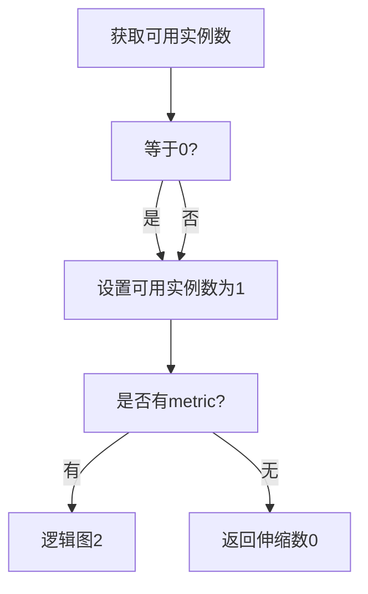
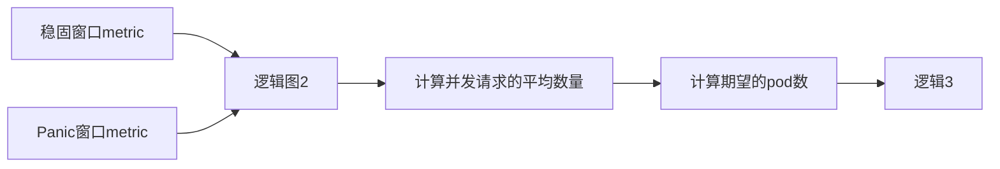
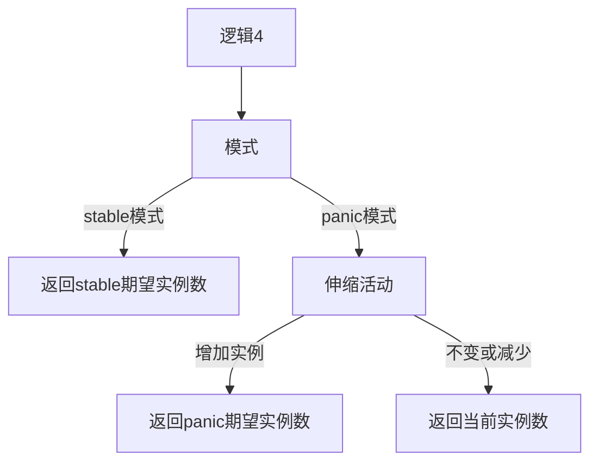

# 1. KPA(knative's pod autoscaler)

KPA有三个组件:

- autoscaler
- activator
- quque-proxy

自动伸缩有两种:

- 预测型: 根据历史数据和当前容量判断如何伸缩
- 反应型: 根据某些条件进行伸缩

KPA是反应型的自动伸缩, Knative Serving会为每个`Pod`配置一个`quque-proxy`, 这里的`Pod`可以理解我一个实例, `activator`会报告实例的容量和并发指标.

<!-- more -->

# 2. 自动伸缩工作场景: 没有实例

没有流量时最终也就没有revision计算实例, 此时`activator`作为流量目标, 如下图:

当有有一个请求发出时, 自动伸缩的步骤如下:

- 请求被发送到`activator`
- `activator`缓存请求, 并且通知`autoscaler`
- `autoscaler`计算决定伸缩个数, 然后更新Knative Service期望伸缩状态
- 最终伸缩`Revision`实例
- `autoscaler`完成实例伸缩
- `activator`检查到有可用的实例
- `activator`将缓存的请求发送给实例
- 实例将请求的返回通过`activator`网关返回给客户端

以上步骤过程如下图:

此时`activator`任然承接流量并导流到实例, 这个设计叫做: burst capacity, 可以防止突发容量

`activator`不负责决定伸缩多少, 只负责决定是否保留这种数据路径, 这依赖于可用实例服务请求的数量; 如果在没有实例时, 有很多请求在短时间内发送, 那么自动伸缩行为有所不同, 此时会进入 panic mode, 有两个不同的行为会发生:

- `autoscaler`对于请求数量更敏感, 判断频率从60秒一次增加到6秒一次
- 不进行实例缩放, 忽略任何缩放条件直到panic mode结束

# 3. 自动伸缩计算逻辑

- `逻辑图1`

- `逻辑图2`

注意: 随着实例数变多, 实例上传的metric也会增多, 这会导致时间窗口内基于metric的计算变慢, 此时Knative使用抽样统计.

- `逻辑3`
  $实例并发=(当前在所有实例QueueProxy中的请求总数+当前所有实例处理中的请求总数)/当前实例数$
  在一个时间窗口内会进行多次抽样数据, 所以:
  $平均抽样并发=实例并发总和/实例个数$
  $平均时间窗口并发=平均抽样并发总和/总抽样次数$
  所以期待的实例数为:
  $期待实例数=平均抽样并发总和/实例目标并发$
  其中`目标实例并发`是用户设置的, 比如设置最大`实例并发数`是10, `可用率`是80%,则实例目标并发是10*80%=8
- `逻辑4`

# 4. 两种模式对比

|     | panic模式 | stable模式 |
| --- | --- | --- |
| 伸缩实例数 | (目标实例数-实际实例数)/(实际实例数) | 目标实例数-实际实例数 |
| 计算持续时间 | 6s  | 60s |
| 操作  | 只增加实例 | 增加或减少实例 |

# 5. [配置自动伸缩](https://knative.dev/docs/serving/autoscaling/)

knative 官方网站有详细的关于自动伸缩的配置介绍, 可以查看: https://knative.dev/docs/serving/autoscaling/