# 0. 声明

本文由 🤖AI 改写润色而成

# 1. 背景介绍

在 Web 浏览器资源有限的环境下，如何高效地展示和交互超大规模的点云数据，是一个公认的技术挑战。本文将探讨如何利用开源库 [Potree](https://github.com/potree/potree/) 来应对这一挑战。

[Potree](https://github.com/potree/potree/) 是一款免费、开源、基于 WebGL 的点云渲染器，专为处理大型点云而设计。它起源于维也纳技术大学的 Scanopy 项目，并融合了 Harvest4D、GCD 博士学院及 Superhumans 等多个研究项目的成果。

为了验证其能力，本文采用了一个真实场景的数据集：**1829 张**、总计 **20.16GB** 的无人机航拍照片。通过开源工具 [ODM (OpenDroneMap)](https://github.com/OpenDroneMap/ODM) 进行三维重建后，我们得到了一个大小为 **731.9MB** 的 LAZ 格式点云文件。直接在前端加载和渲染如此体量的点云文件，对于浏览器而言几乎是不可能完成的任务。而 Potree 正是为此类场景提供了一套成熟的解决方案。

本文不会深入探讨 Potree 的底层实现细节，但其核心技术是基于一种名为**多分辨率八叉树（Octree）**的数据结构。感兴趣的读者可以在 Potree 的 GitHub 仓库中找到相关的理论依据。此外，鉴于本文作者的技术栈偏向后端，我们将重点放在**如何利用各种工具在后端生成 Potree 所需的数据格式**，而非前端的渲染实现。对于前端集成细节感兴趣的读者，可以参考 Potree GitHub 仓库中丰富的 `examples` 来学习和了解。

# 2. 核心处理流程

假设我们从无人机原始图片出发，要生成 Potree 可用的数据，大致需要经历以下几个步骤：

```mermaid
flowchart LR
    IMAGE(原始航拍图) -- 3D重建 --> ODM
    ODM -- 生成点云 --> LAZ(原始点云)
    LAZ -- LAZ修复 --> Lasinfo
    Lasinfo -- 转换为Potree格式 --> PotreeConverter
    PotreeConverter -- 生成 --> OctreeData(八叉树数据)
```



- **3D 重建**: 使用 [ODM](https://github.com/OpenDroneMap/ODM) 工具，将二维图片序列重建为三维模型。其产物之一是 LAZ 格式的点云文件。
- **LAZ 修复**: 使用 [LAStools](https://lastools.github.io/) 工具集中的 [lasinfo](https://lastools.github.io/download/lasinfo_README.md) 工具。此步骤的主要目的是修复由 ODM 生成的 LAZ 文件中可能存在的 `Bounding Box` 数据异常问题，确保后续处理的顺利进行。
- **点云转换**: 使用 Potree 官方提供的 [PotreeConverter](https://github.com/potree/PotreeConverter) 工具，将修复后的点云文件转换为 Potree 的优化格式。产物主要包含三个文件：
  - `metadata.json`: 元数据文件。它是整个点云数据集的“身份证”和“说明书”，定义了坐标系、数据范围、属性等信息。Potree 加载点云时会首先读取它。
  - `hierarchy.bin`: 层级结构文件。这是八叉树的“骨架”或“目录”，描述了所有节点的层级关系和依赖，但本身不存储点的具体数据。
  - `octree.bin`: 八叉树数据文件。这是点云数据的“大仓库”，包含了所有点的真实数据（如坐标、颜色、强度等），并按照八叉树结构进行组织。

这三个文件共同构成了一套基于**八叉树（Octree）和多细节层次（Level of Detail, LOD）**的高效数据结构，这正是 Potree 能够流畅处理海量点云的核心所在。

> [!NOTE] > **关于 LAZ 修复**：此步骤并非总是必需的。然而，在我的实践中发现，ODM 有时生成的 LAZ 文件存在 Bounding Box 数据非法的问题，这会导致 PotreeConverter 运行失败。因此，在流程中加入了这一修复步骤，以增强整个流程的稳定性。

# 3. 工程实现

## 3.1 容器化环境 (Dockerfile)

由于数据处理流程的关键和最耗时的部分是 3D 重建，我们选择 `opendronemap/odm` 作为基础镜像，并在其之上安装其他所需工具。假设项目工作目录结构如下：

```plaintext
.
├── docker
├── docker-compose.yaml
├── Dockerfile
├── LAStools          # Git Submodule
├── PotreeConverter   # Git Submodule
├── src
└── ... (其他后端项目文件)
```

上述目录结构中的 `PotreeConverter` 和 `LAStools` 是通过 Git submodule 引入的。这样做的目的是为了在容器内部直接编译构建这两个工具，确保环境的一致性。最终的 `Dockerfile` 如下：

```Dockerfile
# 使用官方 ODM 镜像作为基础
FROM opendronemap/odm:3.5.5

WORKDIR /code

# 复制必要的源码和配置文件
COPY ./docker ./docker
COPY ./PotreeConverter ./PotreeConverter
COPY ./LAStools ./LAStools

# 安装编译 PotreeConverter 和 LAStools 所需的依赖
# setup_22.x 脚本用于配置 Node.js 22.x 的源
RUN cat ./docker/setup_22.x | sudo bash - && \
  sudo apt-get update && \
  sudo apt-get install -y cmake build-essential libtbb-dev nodejs

# 编译 PotreeConverter
RUN cd PotreeConverter && mkdir build && cd build && cmake .. && make

# 编译 LAStools
RUN cd LAStools && cmake -DCMAKE_BUILD_TYPE=Release CMakeLists.txt && cmake --build .

# (可选) 为 Node.js 后端准备 Prisma 引擎，这是项目特定的步骤
RUN npm install prisma && cp node_modules/@prisma/engines/*.so.node .

# 复制编译后的 Node.js 应用代码
COPY dist/ .
COPY prisma .

ENTRYPOINT []
CMD ["node", "main.js"]
```

## 3.2 核心处理逻辑

以下是后端服务中实现上述流程的核心代码片段（使用 TypeScript 和 `child_process`）。代码省略了完整的 API 设计，仅展示了调用外部命令的关键步骤。

```typescript
// 封装的异步执行命令的函数，类似 child_process.spawn
// spawnAsync(command: string, args: string[]): Promise<void>

/**
 * 步骤 1: 执行 3D 重建
 */
this.logger.log(`[${portfolioId}] 1. 3D 重建开始...`);
const odmScript = path.resolve("./run.sh");
const projectPath = path.resolve(this.DRONE_FILE_ROOT_DIR);
const odmArgs = [
  "--project-path",
  projectPath,
  "--end-with",
  "odm_georeferencing",
  portfolioId,
];

if (body.lowQuality) {
  odmArgs.unshift(
    "--split",
    "200",
    "--pc-quality",
    "low",
    "--feature-quality",
    "low"
  );
}
this.logger.log(`[${portfolioId}] ODM 命令: ${odmScript} ${odmArgs.join(" ")}`);
await this.spawnAsync(odmScript, odmArgs);
this.logger.log(`[${portfolioId}] 1. 3D 重建完成.`);

/**
 * 步骤 2: 修复 LAZ 文件的 Bounding Box
 */
this.logger.log(`[${portfolioId}] 2. LAZ 文件修复开始...`);
const portfolioWorkspaceDir = path.join(this.DRONE_FILE_ROOT_DIR, portfolioId);
const lazFile = path.resolve(
  `${portfolioWorkspaceDir}/odm_georeferencing/odm_georeferenced_model.laz`
);
const lasinfoTool = path.resolve("./LAStools/bin64/lasinfo64");
const lasinfoArgs = ["-i", lazFile, "-repair_bb"];

this.logger.log(
  `[${portfolioId}] lasinfo 命令: ${lasinfoTool} ${lasinfoArgs.join(" ")}`
);
await this.spawnAsync(lasinfoTool, lasinfoArgs);
this.logger.log(`[${portfolioId}] 2. LAZ 文件修复完成.`);

/**
 * 步骤 3: 将点云转换为 Potree 格式
 */
this.logger.log(`[${portfolioId}] 3. Potree 转换开始...`);
const converterTool = path.resolve("./PotreeConverter/build/PotreeConverter");
const converterOutput = path.resolve(`${portfolioWorkspaceDir}/potree`);
const converterArgs = [lazFile, "-o", converterOutput, "-m", "random"];

this.logger.log(
  `[${portfolioId}] PotreeConverter 命令: ${converterTool} ${converterArgs.join(
    " "
  )}`
);
await this.spawnAsync(converterTool, converterArgs);
this.logger.log(`[${portfolioId}] 3. Potree 转换完成.`);
```

# 4. 测试与验证

以下是在特定硬件环境下运行上述流程的性能数据和结果。

### **资源需求**

- **CPU**: 8 核。测试中观察到 CPU 利用率长时间（约 30 分钟）维持在 99% 的满载状态，主要发生在 ODM 处理阶段。
- **内存**: 32 GB。虽然没有进行精确的内存监控，但在不进行图像拆分（`--split` 参数）的情况下，处理过程会因 OOM (Out of Memory) 而被系统终止。通过 `htop` 观察到内存占用峰值曾超过 19 GB。
- **磁盘空间**: 初始可用空间约 470GB 的 500GB 磁盘，在处理完成后仅剩 419MB，几乎被完全占用。这表明 ODM 产生的中间文件和最终产物占用了大量空间。
- **磁盘 I/O**: 测试环境的磁盘读写速度约为 125 MiB/s，这成为一个性能瓶颈。建议使用更高性能的存储（如 NVMe SSD），以达到 500 MiB/s 或更高的吞吐量，从而缩短处理时间。

### **处理结果与耗时**

- **最终文件大小**:
  - `octree.bin`: 3.7 GB
  - `hierarchy.bin`: 1.4 MB
  - `metadata.json`: 4.0 KB
- **ODM 耗时**: 15.72 小时
- **PotreeConverter 耗时**: 45.03 秒

### **ODM 关键参数**

为了在有限的资源下完成处理，我们对 ODM 使用了以下优化参数：

- `--split 200`: 将 1829 张图片拆分为每组 200 张进行处理，有效降低了单次处理的内存峰值。
- `--pc-quality low`: 生成低质量点云。
- `--feature-quality low`: 使用低质量的特征点提取。

# 5. 总结

Potree 提供了一种基于层级结构的流式加载方案，从根本上解决了海量点云在 Web 端渲染的难题。

其工作原理类似于我们日常使用的地图应用（如谷歌地球）：当视野广阔、观察点距离较远时，渲染器只加载和显示低分辨率的概览数据；随着我们放大、拉近视角，更高分辨率、更详细的点云数据才会被动态加载进来。

这种“按需加载”的策略，避免了一次性将全部点云数据加载到内存和显存中的巨大开销，从而实现了对海量点云数据的流畅交互与实时渲染，为 WebGis、数字孪生等领域提供了强大的技术支持。
