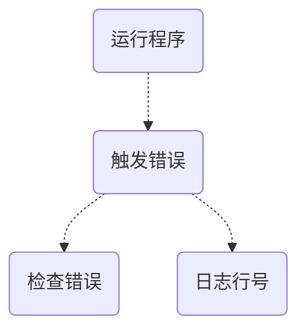

## 0. 业务背景介绍

- [Nestjs:](https://nestjs.com/) 一个 nodejs 后端开发框架, 类似与 express 和 koa, 但是特点是: 面向 OOP 编程方式
- [Sentry](https://sentry.io): 一个基于事件的应用程序监控服务, 通过在应用程序中使用其 sdk 可以无侵入性的捕获程序异常和错误的问题, 然后发送到 sentry SAAS, 开发者可以通过 SAAS 平台对问题进行分析/分配/解决.

​ 本文重点介绍针对已经有的 Nestjs 应用程序如何添加和配置 Sentry, 达到服务监控的目的. 在实践之前需要提前做的准备有:

- 一个 nestjs 应用程序
  - 至少有一个路由可以出发一个自定义异常
- 注册完成 sentry
  - 创建一个`node-express`的项目
  - **获取 dsn 信息**

## 1. 配置 Sentry

### 1.1 安装依赖

```bash
yarn add @sentry/node
```

### 1.2 集成 Sentry

```js
Sentry.init({
  dsn: "https://xxxx@oyyyy.ingest.sentry.io/zzzz",
  integrations: [
    new Sentry.Integrations.Http({ tracing: true }),
    ...Sentry.autoDiscoverNodePerformanceMonitoringIntegrations(),
  ],
  release: "research", // should be same with webpack source map release, that means the same version
  tracesSampleRate: 1.0,
});
app.useGlobalInterceptors(new SentryInterceptor());
```

在 nest 中`SentryInterceptor`设计如下:

```typescript
import {
  Injectable,
  NestInterceptor,
  ExecutionContext,
  CallHandler,
} from "@nestjs/common";
import { Observable } from "rxjs";
import { tap } from "rxjs/operators";
import * as Sentry from "@sentry/node";

@Injectable()
export class SentryInterceptor implements NestInterceptor {
  intercept(context: ExecutionContext, next: CallHandler): Observable<any> {
    return next.handle().pipe(
      tap(null, (exception) => {
        Sentry.captureException(exception);
      })
    );
  }
}
```

### 1.3 webpack 配置

```js
/* eslint-disable @typescript-eslint/no-var-requires */
const path = require("path");
// const SentryWebpackPlugin = require("@sentry/webpack-plugin");

module.exports = (options, webpack) => {
  const lazyImports = [
    "@nestjs/microservices/microservices-module",
    "@nestjs/websockets/socket-module",
    "class-transformer/storage",
  ];

  return {
    ...options,
    devtool: "source-map",
    entry: path.resolve(__dirname, "src/main.ts"),
    output: {
      filename: "main.js",
      path: path.resolve(__dirname, "dist"),
      sourceMapFilename: "main.js.map",
    },
    externals: [],
    plugins: [
      ...options.plugins,
      new webpack.IgnorePlugin({
        checkResource(resource) {
          if (lazyImports.includes(resource)) {
            try {
              require.resolve(resource);
            } catch (err) {
              return true;
            }
          }
          return false;
        },
      }),
    ],
  };
};
```

### 1.4 打包

```bash
➜  npm run build
➜  tree dist
dist
├── lambda.js
└── lambda.js.map
```

## 2. 执行和验证



### 2.1 触发错误日志

```bash
# 运行程序,触发错误,观察日志
NODE_OPTIONS=--enable-source-maps node dist/main.js
...
[Nest] 23930  - 2023/04/13 15:05:04   ERROR [ExceptionsHandler] some error: 2023-3-13 15:5:4
Error: some error: 2023-3-13 15:5:4
    at AppController.error (webpack://serverless-tutorial/./src/app.controller.ts:35:11)
    at webpack://serverless-tutorial/./node_modules/@nestjs/core/router/router-execution-context.js:38:1
    at InterceptorsConsumer.transformDeferred (webpack://serverless-tutorial/./node_modules/@nestjs/core/interceptors/interceptors-consumer.js:31:1)
    at webpack://serverless-tutorial/./node_modules/@nestjs/core/interceptors/interceptors-consumer.js:15:1
...
```

> 注意: NODE_OPTIONS=--enable-source-maps 这是可以获取源代码行号的关键

### 2.2 Sentry Issue 列表:


### 2.3 Sentry Issue 详情:


### 2.4 其他测试结果

| 测试项                | SourceMap 工作? | Sentry 工作? | 注意                                                        |
| --------------------- | --------------- | ------------ | ----------------------------------------------------------- |
| 本地 nest api service | y               | y            | 使用@sentry/node                                            |
| 本地 aws lambda       | y               | y            | 使用@sentry/serverless                                      |
| aws lambda            | no              | y            | 使用@sentry/serverless<br />lambda 使用 serverless 框架创建 |

> aws lambda source map 问题见 Troubleshooting

## 3. Troubleshooting

- aws lambda 为什么 SourceMap 不工作?

  这可能与 aws lambda nodejs 运行时有关, 可以从[这个 issue](https://github.com/aws/aws-cdk/issues/19067)获取信息 [解决方案](https://serverless.pub/aws-lambda-node-sourcemaps/): 使用[source-map-support](https://www.npmjs.com/package/source-map-support)包, 具体做法如下:

  - 安装包

    ```bash
    yarn add source-map-support
    ```

  - 修改入口文件, 增加如下代码在顶部

    ```typescript
    # nodejs
    require('source-map-support').install();
    # es6 or typescript
    import 'source-map-support/register'
    ```

  另外使用`source-map-support`可以不用`NODE_OPTIONS`
