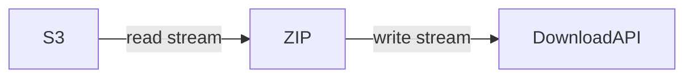

### Change Log:
- 2020-04-11: add the `Issue` part

### 1. Basic

- S3 file produce a readable stream
- combine multiple readable stream into one zip stream
- transform writeable stream to api for download


### 2. Research
- Does S3 support stream reading?

    get the signed url to get the response stream 
- How to combine multiple readable stream in one zip stream?
    - combined-stream to combine multiple read stream or use the archiver `append` function with multiple times
    - archiver
- How to trasnform writable stream as a REST api?
    - make zip steram to response directly
    - set the response with stream header
- More think
    - performence
    - impact on existing service

### 3. Code
- source code reference
    - [s3-zip](https://github.com/orangewise/s3-zip)
    - [s3-files](https://github.com/orangewise/s3-files)

stream-download-v3.ts:
```
import http from 'http';
import { getAWSS3 } from './src/lib/aws';
import archiver from 'archiver';
import { Readable } from 'stream';

http.createServer(async (req, res) => {
  // Step1: create origin readable stream
  const s3 = getAWSS3();
  const bucket = 'dev-ng-main';
  type FileData = {
    [key: string]: string;
  };
  const allFiles: FileData = {
    'ngiq-app-desktop-1.2.0-20191217_155304.1493b47.AppImage': 'nomal.AppImage',
    'test/some_obj.dmg': 'test/some.dmg',
    'ngiq-app-desktop-test-control-fullscreen.AppImage': 'test2/control.AppImage',
  };
  const keys = Object.keys(allFiles);
  type KeyToVirtualPath = {
    [key: string]: Readable;
  };
  const virtualPathRS: KeyToVirtualPath = {};
  for (const key of keys) {
    const readStream = s3.getObject({ Bucket: bucket, Key: key }).createReadStream();
    virtualPathRS[allFiles[key]] = readStream;
  }

  // Step2: combine all readable into one zip transform stream
  const zip = archiver('zip')
    .on('error', (err) => {
      console.error(err);
      res.end();
    });
  const allVirtualPath = Object.keys(virtualPathRS);
  let readStreamEndCount = 0;
  for (const vp of allVirtualPath) {
    const readStream = virtualPathRS[vp];
    zip.append(readStream, { name: vp });
    readStream
      .on('end', async () => {
        readStreamEndCount++;
        console.log('end stream', vp);
        if (readStreamEndCount === allVirtualPath.length) {
          await zip.finalize();
        }
      })
      .on('error', (err) => {
        zip.emit('error', err);
      });
  }
  // Step3: zip file stream to response stream
  const zipName = 'test.zip';
  res.setHeader('Content-Type', 'application/octet-stream');
  res.setHeader('Content-Disposition', 'attachment; filename=' + zipName);

  zip.pipe(res);

}).listen(3000, () => {
  console.log('listening at 3000');
});
```

How to verify the result:
```
// step1 start the server
ts-node stream-download-v3.ts
// step2 visit http://localhost:3000 in browser
```

### 4. Issue
- [s3.getObject(params).createReadStream() Timeouts ](https://github.com/aws/aws-sdk-js/issues/2087)

you can resolve the issue by use `PassThrough` or make iteration to a serializer processing.