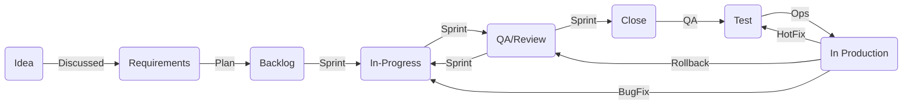

回看敏捷开发过程带来了的一些思考:

```mermaid
graph LR

A(Idea) --> | Discussed | B(Requirements)
B --> | Plan | C(Backlog)
C --> | Sprint | D(In-Progress)
D --> | Sprint | E(QA/Review)
E --> | Sprint | D
E --> | Sprint | F(Close)
F --> | QA | G(Test)
G --> | Ops | H(In Production)
H --> | BugFix | D
H --> | HotFix | G
H --> | Rollback | E
```
敏捷实践心得体会:
- 周期要短, 不超过2周
- 需求要明确, 不确定/不可细化/不可验证的不做
- 提早细化需求确定技术方案
- 开发依赖前置
- 测试用例前置
- 风险及时暴露, 尽快决策
- 迭代中期巡检
- 开发自测
- CodeReview
- 反馈机制