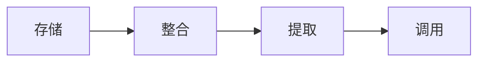

# 1.  高手的暗箱

利用规律，放大努力: 获得百倍收益的关键，并不是百倍努力。每个时代的高手都在
利用社会和科技的底层逻辑撬动自己，实现跨越式的成长。

## 走在时代前面的明白人

- 知道只是在哪里比知道知识是什么更重要
- **改变认知: 调用知识而非记忆知识，联机的独立思考，人机合一**


- 存储交给电脑, 未来世界的认知力
   - 搜索能力
   - 思考能力
   - 洞察能力
- 建立知识的索引
- 思考方式改变: 独立思考vs联机思考
   - 如果有独立思考能力, 联机思考让思考的质量变高, 迭代更快
- 任何一条行业链，一旦某个链条有能大幅提高效率的新技术，这个领域的核心竞争力就会变化
- 一个人能够用机器学习和处理信息，用大脑整合和创新思想，用系统思维思考问题，会是未来最有竞争力的

<!-- more -->

## 拉斐尔也用投影仪

- 如果拉斐尔在用投影仪，今天各领域的高手是否也有自己的“暗箱”？
- 长江商学院的校训是: 取势、明道、优术
- 没有一个人是仅凭努力、天赋、机遇而获得巨大成功的，跃迁式的成功都是利用了更底层规律，激发了个体的跨越式成长

## 个体的跨越式成长

- 所有跃迁都有类似的模式：受到激发的突变，没有中间状态
- 如果把个人通过刻意练习、自我迭代而带来的渐进式进步叫作`自我迭代`，那么利用科技、社会系统的能量，快速跳跃式升级，则是`自我跃迁`
- 个人跃迁的三个阶段
   - 知识跃迁: 持续的学习、阅读中，突然有一天一个概念击中你，你打开了一个全新的视野，过去困扰你的一切突然清清楚楚，顿悟
   - 能力跃迁: 按照新领悟的方法持续地积累、练习、见人、蓄势，却长久没有什么变化。有时候，你都快要放弃了，但是突然有一天你发现自己的能力和水平上升了一个台阶
   - 能级跃迁: 从能力跃迁到能级跃迁，则是一个价值从内向外的过程
- 心智模式或者说范式的转变，对内提升潜能，对外发现可能，这就是一个人认知跃迁的关键
- 聪明的勤奋者
   - 升级趋势
   - 洞察心智
   - 聪明的勤奋
- **“高手”都懂得利用更底层的规律，激发个体的跨越式成长——这是他们鲜为人知的“暗箱”**

## 掌握时代的魔法

- 时代的溺水者
  - 无法掌握注意力
  - 无法过滤信息
  - 无法与陌生人协作
- 人类思维如何与互联网共同进化
  那些不具有基本注意力素养（包括辨别真假、参与、合作、自我保护意识）的人容易陷入批评家指出的所有陷阱：浅薄，轻信，分神，异化上瘾。……我们应该学会管理思维以便使用工具思考而不失重点，我愿意付出代价来获取互联网提供的资源

## 外包大脑成为超人

- 人类也要把自己大脑外包一部分，聚焦最重要的能力，跃迁成超人
- 大脑不该用来记忆，而是要用来观察、思考、创造和影响他人。这本书谈到的，就是这些在新时代高手必备的认知、一定要理解的社会规律，以及必须掌握的技能
- 未来是一个个体崛起的时代，却不是每个个体都崛起的时代，顺应时代的人跃迁式崛起，其他人舒服地被机器圈养，这是一个留下少数巨人、一堆侏儒的时代
- **时代特征: 信息变多，思考变浅；机会变多，竞争跨界；随时干扰，永远在线**
- **把不重要的技能外包，聚焦核心技能的跃迁**

# 2. 高手战略

在高价值区，做正确的事: 处处有机会，就等于处处没机会;竞争越是开放，个人越需要
打磨深思熟虑后做选择的战略能力——找到那些“更少但是更
好”的事。

- **今天是一个机会更多，但概率更小的世界**。处处有机会，就是处处有竞争
- 当资源丰富时，选择的能力比执行更重要
- 深思熟虑后做选择的**战略能力——要找到那些“更少但是更好”的事**

## 只打甜蜜区里的球

- 找到高价值区
- 战略性关注, 战略性忽略非高价值目标
- 用最有把握的方式取胜

## 新东方名师崛起之路

- 高价值区特点
	- 高价值区往往是反直觉、说了你都不信的区域
	- 高价值区需要高竞争力
	- 高价值区随着时代在改变
- 第一次跃迁：用二八法则高效成长
	- 与其用100%的精力学习一个领域的100%，不如用80%的精力学习每个领域20%的精华
- 第二次跃迁：利用系统放大名气
- 第三次跃迁：与最优秀大脑互联
	- 抓住了知识杠杆、利用平台红利，以及和最优秀的人联机涌现

## 幂律分布：发现世界的杠杆点

- 幂律的第一个特征，就是高度的不平均
	- 不公平就是大自然的一种常态
- 幂律的第二个重要的特色，是分形（fractual）。分形就是“一个图形细分后，每一个部分都是整体缩小后的形状”
- 幂律无处不在，给我们的一个最重要的启示是：社会和自然的大部分系统都有重点，做事情一定要抓重点，持续地抓住重点，就抓住了最高效率的关键
- **幂律告诉我们，每个系统里都有杠杆点，找到这个杠杆点，能迅速放大一个人的努力，达到事半功倍的效果**
- 幂律分形，意味着刚才提到的系统的重点都能继续再分，找到更微妙的重点。杠杆点上，还能继续加杠杆
- 在一个流动、开放的社会里，阶层分化是稳定且可预期的
- 互联的关键是让每一个系统产生交换，从正态分布逐渐转向幂律分布。在这个过程中，头部效应越来越严重
- 在复杂系统中，细小的初始值的差异，会带来巨大的不同结果，经济学界称之为“横向分配不均”（horizontalinequality），即收益和内在价值，比如智力、能力，不一定有相关性
- 社会发展结论
	- 停止抱怨。世界就是不公平的，接受它。阶层分化是开放社会的必然趋势；
	- 持续学习=>扩大视野，提高效能=>扩大移动能力；
	- 持续关注、观察、验证高价值区；
	- 向正确方向移动，爬上幂律顶部
- 高手战略的两个规律杠杆
	- 对内，通过二八法则三次方，持续放大自我效能；
	- 对外，通过移动到系统的头部，获得系统巨大推动力

## 头部效应：站位比努力更重要

- 头部效应
	- 头部收益更高
	- 头部加速度更快
- 能力提升需要三个要素：好的方法论，刻意练习，大量的实战机会。而头部的人会同时拥有这三个机会
- 一个充分竞争、互联的时代，是几个头部与众多长尾的时代
- 收益不仅和能力相关，更与站位相关。优秀是一种系统的显现
- 优秀是幂律规则的简单显现——天时、地利、人和，取势、明道、优术，不管是兵法还是商道，都把时机和站位放到了个人努力的前面
- 如何找到自己的头部?
	- 头部就是你所在赛道里的高价值并且有优势的领域
	- 要专注于做那些高价值、高优势的事
	- 头部矩阵: 价值+优势
	  
    - 头部: 高价值--高优势
    - 肥尾: 高价值--低优势
    - 小山头: 低价值--高优势
    - 沙漠: 低价值--低优势
- **原则：从价值而非优势出发**
	- 先确定高价值，再思考优势
	- 不要因为容易而去做一件事，要因为有价值才做。不要因为便宜而买一件衣服，要因为值得才买。不要因为彼此习惯了就结婚，要因为相爱才结
	- 因为我们不怕苦，怕苦得没价值；不怕累，怕累得没有意义
- **原则：思考差异化优势**
	- 处处都有的机会，很多不属于自己
	- 成功是成功之母，成为鸡头是变成凤头的捷径
- **原则：从身边的头部做起**, 先鸡头后凤头
	- 战略必须先帮助你在当下破局，否则就毫无意义
- 头部效应就是：通过观察和判断，抢占高价值、有优势的头部，然后从小头部走向大头部; **头部=高价值×高优势；抢占头部、持续迭代**

## 用头部效应就业、择城、选创业赛道

- 鸡头比凤尾离凤头更近
- 小公司一个萝卜一个坑，一定要学会向外看，你的竞争对手在公司外，全行业的小朋友都是你的对手
- 创业的头部效应
	- 聚焦细分战略
	- 转移周边战略
	- 农村包围城市战略

## 专注: 高手的护城河

- 对弱者来说，专注是最好的进攻策略；对强者来说，专注是最好的防守策略
- 聪明人的最大诅咒——贪婪而不专注
- 上天给你无限的机会，却只给你有限的时间、精力和才华，所以越是优秀，越要专注
- **专注是高手的护城河，先占据不败之地，然后慢慢获得细小优势**

## 迭代：聪明人的笨功夫

- 灵感没法刻意练习，没法打磨手艺。灵感没有护城河
- 聪明不是护城河
- 新手看胜负，高手看概率
- 妙手是成为高手的最大障碍，迭代的手艺才是正途
- 专注让你无敌，迭代让你精进
- 弱小优势持续迭代而产生的强大力量
- 好的成功是聪明人花的笨功夫
- **持续迭代，系统性进步；不求妙手，不得贪胜**

# 3. 联机学习

找到知识的源头, 提高认知效率: 在知识爆炸、终身学习时代，人与人之间比拼的不是学与不
学，而是认知效率。学习前，想明白学什么、怎么学、有什么用和
如何兑现。功利学习法：学得更好，却学得更少

- 识别知识的源头
  - 一手信息: 知识的源头
  - 二手信息: 忠实转述一手信息
  - 三手信息：为传播而简化和极端化观点的陈述
  - 四手信息：出于各种动机充满个人经验的情绪化表达
  - 真传一句话，假传万卷书
- 知识的源头探测仪(方法)
	- 能辨别和找到知识源头
	- 跟随知识源头的人
	- 成为知识源头
	- 辨别一二三四手信息，走向知识的源头，并与那些人站在一起。总有一天，你也会成为创造知识的人
- 功利读书法
	- “认知效率”：认知收益和时间精力之比
	- 提高认知效率最有效的工具就是“极强的目的性”，我称之为功利读书法
	- 认知心理学认为，成人学习有三个前提要求的时候效率最高，即有目标导向、有即时反馈、最近发展区
	- 根据认知目的不同，设定不同的目标，分配不同的资源
		- 认知性阅读: 攻读, 分配更多时间和精力
		- 知识性阅读: 适合碎片化学习和社交型学习
		- 娱乐性阅读: 放松和陶冶, 累的时候翻几页
		- 极其功利地分配资源——从你自己的需求开始，区分三种阅读，设定目标，分配资源
	- 不要从第一页开始读: 先选书(豆瓣/亚马逊书评)->看目录->看重点章节
- 萃取知识晶体
	- 知识变成知识晶体
		- 树状结构：体现事物层级、包含关系
		- 关联结构：体现事物相互关系
		- 序列关系：体现先后、因果关系
		- 数据结构：体现数量差异关系
	- 知识晶体提取
		- 大量看识晶体
		- 尝试模仿晶体
		- 自己创造知识晶体
- 找到知识源头、极其功利地读书、萃取知识晶体，这就是提高认知效率的核心方式

## 联机学习者：成为知识的路由器

- 先打磨第一个知识模块
- 抛出去，换回别人的知识模块
- 重复前两步，积累足够多的知识模块
- 整合出自己的体系，实现知识跃迁
- 学习的三种方式
  - 自学：自己找答案
  - 联机学习：和同行交流，用答案换答案
  - 跨界联机学习：跨行学习交流，用答案换答案

## 终身提问者：问题比答案更有效

- 学习的速度，跟不上遇到问题的速度。这是你焦虑的根源
- 你需要的，是用来解决问题的知识
- 真正的专业是你“特别擅长解决某类型的问题”
- 怎么应付知识折旧？两个方法：
  - 第一是多读不容易折旧的经典，就是我在前面说的一二三四手知识；
  - 第二就是不断更新最新的内容
- 提问的力量
  - 提问即思考
  - 提问即创造
    - 创造力包含多种认知工具，每一种只适用于特定种类的问题。有三种形式的创造：一种是灵感迸发，一种是厚积薄发，还有一种是即兴发挥
- 以问题为中心
- 基于问题的学习让你关注点更少，进步更大，有自己的试金石，是“更少而更好”的事
- 比终身学习者更有效的，是终身提问者
- 终身学习工作箱
  - 别列书单，列问题单
  - 假装写本书: 想集中研究一个话题，最好的方式就是假装自己要写本书
  - 问题少年提问术
    - 不做伸手党，准备充分、目标清晰
    - 好问题都是组合拳
    - 输出答案
- 5个绝佳的思考角度
  - 证据：我们怎么知道什么是对的、什么是错的？有什么证据可以证明？
  - 视角：如果站在其他人的视角看这个问题，会怎么样？如果换一个角度会怎么样？
  - 联系：他们之间是否存在某种规律和模式？我们以前在哪儿见过这种模式？
  - 猜想：如果它与众不同，那是什么样的？
  - 相关：它为什么重要？

## 知识IPO：把知识变现成价值

- 大师的知识管理特点
  - 终身提问
  - 跨领域整合
  - 知识IPO系统
    - I 输入问题 Input a question, 以持续解决问题为目标
    - P 解决问题 Problem solving, 以整合多学科知识为手段
    - O 输出产品 Output, 通过咨询研发, 授课整合和写作, 让思路产品化
  - 知识IPO：以提出问题为驱动、以解决问题为整合、用输出倒逼输入产品化
- 设计自己的知识IPO
  - 有一个真实的/高价值,并且有可能被解决的问题(I)
  - 不要学习知识, 而是要解决问题(P)
  - 输出倒逼输入(O)
-  IPO实践误区
  - 希望憋大招
  - 害怕分享
    - 分享是检验解决问题的最好方式
- 知识IPO工具箱
  - 放大碎片化价值, 一点一滴沉淀
  - 设计自己的MVP, 设计一个容易入门的可交付知识IPO产品
  - 首席知识官, 整理知识也是一种知识重建
    - 如果你并不擅长创作知识，尽心尽力地做好首席知识官也是非常了不起的
    - 千万要记得让知识成为产品，不要成为自嗨的收藏品

## 自上而下: 构建自己的知识体系

- 知识体系金字塔
  ```mermaid
  graph LR
  
  问题向导 --> 联机思考 --> 知识结晶 --> 信息源头
  ```
  - 站在知识源头，萃取知识晶体；
  - 联机学习，用一块晶体换回来更多晶体；
  - 以问题为中心学习，创造自己的问题树；
  - 用知识IPO让知识变成价值

# 4. 破局思维

升维思考，解决复杂问题: 为什么很多问题无解?因为答案根本就不在系统内。“单维思
考者”永远看不懂整体的“系统思维”，看懂系统，才能破局。

## 人生就是一次次破局

- 破局先识局
  - 陷入局中来回重复焦虑、浮躁
  - 在当前局中无法找到答案
  - 不识庐山真面目，只缘身在此山中
- 破局的智慧
  - 第一序、第二序的改变, 复杂系统，回路，层级，跃迁 思考
  - 不怕痛苦，怕痛苦得没有意义

## 升维: 解决那些无解的问题

- 生活中的无解问题
  - 不陪——分手——陪——和好——不陪
  - 减肥——少吃——瘦——忍不住吃——胖——减肥
  - 没产品——没客户——没产品
  - 拖延——忙——乱——忙——拖延
- 打破轮回:第一序、第二序的改变
  - 第一序改变:系统内改变，改变状态，改变体验
  - 第二序改变:对于系统的改变，改变模式，改变结果
  - 生活无解问题升维思考
    - 不是陪不陪，而是如何陪的问题
      - 一场恋爱，其实是两个心智模式的系统反应
    - 不是少吃，而是加速代谢, 你不是瘦了，而是变得虚弱了
    - 不是关系问题，而是目标问题
      - 我们常常改变，是为了不变
    - 不是态度，而是能力问题
      - 听不见指示、搞不清重点、划不明白边界
- 所谓的跃迁，就是一次次让自己做第二序改变，一次次地破局。而
  改变的第一步，就是识别所在的系统

## 系统: 新手看树木，高手看森林

- 什么是系统

  - 所有的系统都是由元素、关系和功能三部分组成
  - 元素之间的关系比元素更重要，整体大于部分之和，多出来的部 分就是元素之间的关系
  - **第一序改变, 关系结构不变，系统的结果也不会变。第二序改变，改变的就是 系统的结构**(第一序改变状态，第二序改变系统)

- 还原论系统论

  | 传统思考方式                                            | 系统思考方式                                                 |
  | ------------------------------------------------------- | ------------------------------------------------------------ |
  | 问题的因果关系很明显                                    | 问题的因果关系不明显,不直接,而且尝尝互为因果                 |
  | 外界的人和事是我们问题的根源,只有换掉他们, 问题就解决了 | 我们自己创造了自己的问题, 改变自己的认识和行为, 对解决问题有很大的帮助 |
  | 一个方法若短期有效, 长期也有就有效                      | 短期的修修补补, 长期反而有坏处                               |
  | 优化每个部分就能优化整体                                | 优化结构就能优化整体                                         |
  | 下猛药, 同时开始很多独立的改变                          | 只做几个关键的长周期动作, 会让整体改变                       |

  		- 这个世界的绝大部分运作，都不在你眼前发生，世界早已先你而行。如果你看不懂系统，就是现代世界的睁眼瞎
  		- 新手要学习系统，老手会利用系统，而高手需要破局
    - 一个人看问题有见地，无非两个方向——看得远和看得透
      - 远: 找到过去和现在的关系，找得到“回路”
      - 透: 理解事情背后的真正规律，看到事情背后的“层级”

## 回路:设计人生的增长引擎

**从时间维度看到事物发展的脉络，找到过去和现在的关系**

- 4种增长引擎
  - 好习惯
  - 从兴趣培养到能力养成
  - 快速学习的知识**IPO**
  - 企业管理中的**“**信**——**任**”**循环
- 4种死亡螺旋
  - 穷者越穷
  - 投入不足
  - 工作狂循环
  - 做自己
- 回路工具箱
  - 识局
    - 反馈回路都有一个玩死人不偿命的特点:短期感受和长期收益总是相悖
  - 搭建正循环系统，破坏负循环系统，切断自毁线路
    - 逆时间打断负循环
    - 顺着时间搭建正循环
  - 学习一些能自增长的技能
    - 读写能力
    - 破英语
    - 社交能力
    - 解决问题
    - 聪明的善良

## 层级:看问题很透彻的技术

**从空间维度理解事情背后的真正规律。上层决定下层，下层无解，跃迁一层有答案**

- 高效能人士的多层系统
  - 目标
  - 方法论
  - 投入
- 勤奋的三重境界
  - 很努力
  - 方法论勤奋
    - 你今天遇到的问题，早就有人经历过，并且找到
      了更好的方式。你所要做的，只是学习
    - 上层缺一棵清晰的问题树，底层缺好的执行力和精力管理
  - 更少目标，战略勤奋
- 理解多层系统，解决复杂问题
  - 上层决定下层
  - 下层无解，向上一层
- 层级思考工具箱 -- **ETA**脱困四问
  - 第一问(Emotion):我在什么情绪之中? 找出情绪类别
  - 第二问(Event):发生了什么? 挖掘情绪背后的事实
  - 第三问(Target):我原本想要什么? 找到期望目标差距
  - 第四问(Action):我如何改进? 行动改变

## 控制点:让复杂的事尽在掌控

- 多层布点
  - **真正的好组织，都是多层控制的**
  - 愿景——战略——资源——管理——执行
- 单点可控
  - 四类控制点: 能力、努力、难度、运气
  - 掌握者: 能力>难度>努力>运气
  - 机会者: 运气>难度>努 力>能力
  - 多层布点，层层可控
- 目标折射
  - 两点之间，不是直线最快，而是阻力最小的那条线最快
  - 暂时不知道梦想，那就先练好能力
  - 所谓成熟，就是理解了世界的复杂性，不再要求一味走直
    线。在路线问题上，拥抱折射，在最终结果上专注不动。两点之
    间，阻力最小的线最快
- 失控:你是怎样玩死自己的
  - 思维惯性
  - 困在底层
  - 过于封闭

## 一个故事:**“**天哪，她有个大牙缝!**”**

- 这个世界的绝大部分运作，都不在你眼前发生，世界早已先你而行
- 如果你看不懂系统，就永远无法理解事情的本质

# 5. 内在修炼

跃迁者的心法: 真正的改变都是逆人性的。你可以了解所有跃迁的技术，但推动跃迁的关键动力，是我们要成为什么样的自己

## 时代跃迁者的新修炼

- 纯粹理性的人，就像是一把没有刀把的锋利的刀

## 看世界:开放而专注

- 贫富差距变大，不意味着穷人更穷
  - 幂律法则并不是零和游戏
  - 看不见的手，不仅重新分配了资源，也举起了整个系统
  - 从长远来说，开放者一定会赢，头部的开放者一定会强
  - 看不得人好、不承认自己差的人最爱封闭体系
- 开放是道德修养，更是理智选择
  - 增量、终身提问、探索、随喜赞叹......这些词蕴含同一种智慧:提 醒我们要保持开放
  - 要做见得人好的人学习见得人好的思想
  - 一个封闭的系统，一定会熵增，趋于平均和无序
    - 封闭的系统就意味着不进食的身体会死亡，不开放的大脑 会枯亡，不开放的社会会衰亡
- 开放才能专注
  - 经历越多，越能明白，高明与不高明的观点的差距并不在于智商，而是在于眼界
  - 当你站在趋势的高度看待产业，站在行业的高度看待企业，站在价值链的高度看待自己，你会理解什么是真正需要专注的竞争力
  - 专注和钻牛角尖的最大区别就是视野，视野来自开放
- 贫穷的本质
  - 贫穷是一种追求暴利的心态
  - 穷人贫穷是因为他们的注意力都放在如何解决温饱的问题上，很少有多余的“思维带宽”思考长 远发展的问题
  - 越是注意力、自控力稀缺，越是没法想远，只能贪图短期翻盘或享乐; 而越是这样，就越深陷劳而无功的苦差事之中，
    造成进一步的稀缺
  - 贫穷不是一种资源，而是一种心态，那么脱贫就不能靠抓住某 个机会、学会某个招数，而是要靠一套打法、一种心
  - 开放才能不断找准高价值区，专注才能在自己的能力圈内修建护城河，不被其他东西带跑
- 你对外界的看法，决定了你能走多远
- “开放而专注”九律
  - 见得人好，经常随喜赞叹。
    
  2. 找到自己领域的知识源头，并分享。
  3. 不随便崇拜谁。一旦崇拜，以他为顶，你的系统就又封闭了。 
  3. 不再认为自己不喜欢、看不懂的东西就是傻的。
  5. 小心那些“一切都能解释得通”的上帝视角感理论。
  6. 对水平没你高的人要宽容，因为你也没有掌握真理。
  7. 留出10%~30%的时间，给自己不懂也不太会接触的领域。
  8. 站在更高角度，发现和专注于自己的独特之处。
  9. 专注于自己的人生大问题。

## 看自己:迟钝而有趣

- 迟钝也是一种竞争力
  - “延时管理”，通过调 整响应速度获得更低成本
  - 在一个资源很多、多重博弈的世界，缓慢反应的能力比敏感有效很多，迟钝比敏捷更加重要
- 第一反应与第二反应
  - 越庞大的系统，反馈的周期越长，越需要更久的时间和耐心
  - 最好的方式就是克制第一反应，等待第二反应
- 关闭朋友圈4个月的损益报告
  - 短期体验好的事情，似乎总是很难达成长期的深远影响
  - 而缺乏深
    远把控，又反过来让人无法把控未来，焦虑浮躁，空虚没成就感，更紧
    迫地需要短期刺激
  - 迟钝的人懂得克制第一反应，等待重要的事情浮现
- 成为一个有趣的人
  - 迟钝不是慢，是看到了更大的系统
  - 有趣的
    人不是浪，而是看到了更远的格局
  - 成功是有限游戏，成长是无限游戏;项目是有限游戏，事业是无限游戏;生命是有限游戏，意义是无限游戏
- “迟钝而有趣”七律
  - 对不重要的事，漠不关心。
  - 忍住第一反应，等待第二反应。
  - 不追热点，等要点浮现。
  - 寻求整体最优解，站在长周期做判断。
  - 多元，定期做点儿不靠谱、有趣无用的事。 
  - 成功是小概率事件，找到自己的无限游戏。 
  - 放下焦虑，不要放下好奇心

## 看人际:简单善良可激怒

我们从“熟人社会”，逐渐步入了“陌生 人社会

- TFT策略: 
  - **善良**: 总是在表达善意，总是选择合作，而且永远 不会主动背叛
  - **可激怒**: 当对方出现背叛行为，及时识别并且一定要报复，不要让背叛者没有损失
  - 宽容: 不因为对方的背叛而长期怀恨在心，没完没了地报复，而是让对方调整自己，重新回到合作轨道上来，既往不咎，恢复合作
  - **简单**: 逻辑清晰简单，易于识别，能让对方在较短时间内理解策略

## 极致的聪明和善良

- “专注”这把刀，是安在“开放”上的，没有开放的心态和眼界，不可 能专注
- “好奇”这把刀，是安在“迟钝”上的;不能理解系统，没法理解留白 的重要性，也就无法安心获得乐趣
- “可激怒”这把刀，是安在“简单善良”之上的; 不能理解系统，没法理解留白 的重要性，也就无法安心获得乐趣
- 外在的聪明，总是安在内在修炼之上。极度的聪明，往往就是极度的善良
- 从一个很功利、顶级聪明的 角度出发，最后推导出来的东西，往往会是善良的，顶级的善良
- **现代高手的7个心智关键词:开放、专注、迟钝、有趣、简单、善良、可激怒**
- **面对世界，开放而专注，进入系统**
- **面对自己，迟钝而有趣，智慧而超然**
- **面对他人，简单、善良、可激怒**
- **面对不确定，善良些吧**