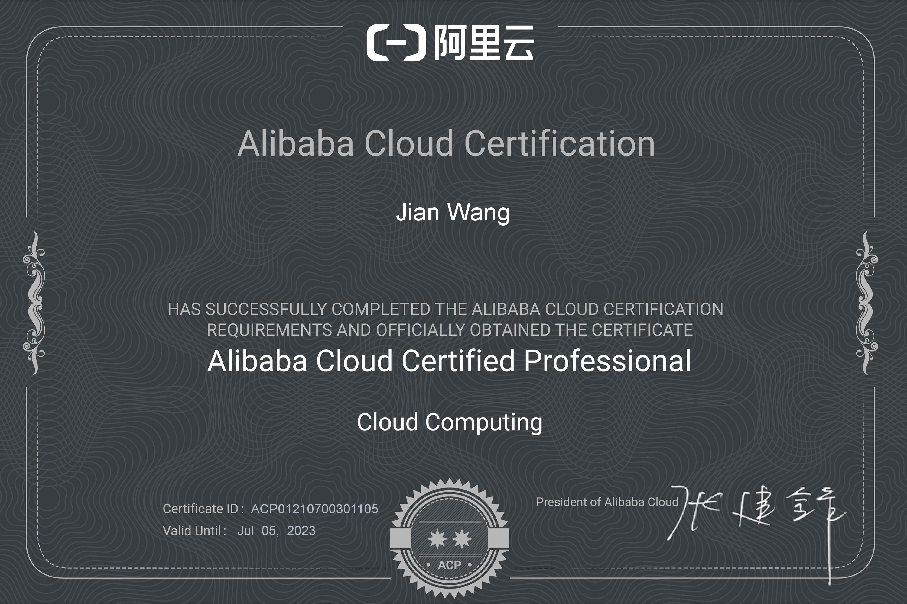
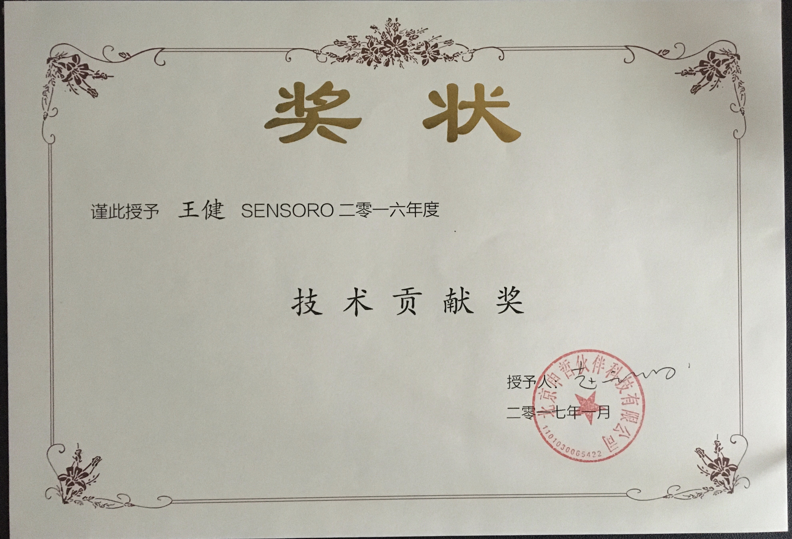

### Brief Introduction
- name: Jimmy Wang
- address: Beijing/Xi'an, China
- jobs: DevOps/Backend Engineer
- skills: Nodejs/Terraform/Aliyun

### My Other Blogs 
- [OSChina](https://my.oschina.net/jimmywa)

### Favorite RSS Feed
- [阮一峰的网络日志](http://www.ruanyifeng.com/blog/)
- [酷 壳 – COOLSHELL](https://coolshell.cn/)
